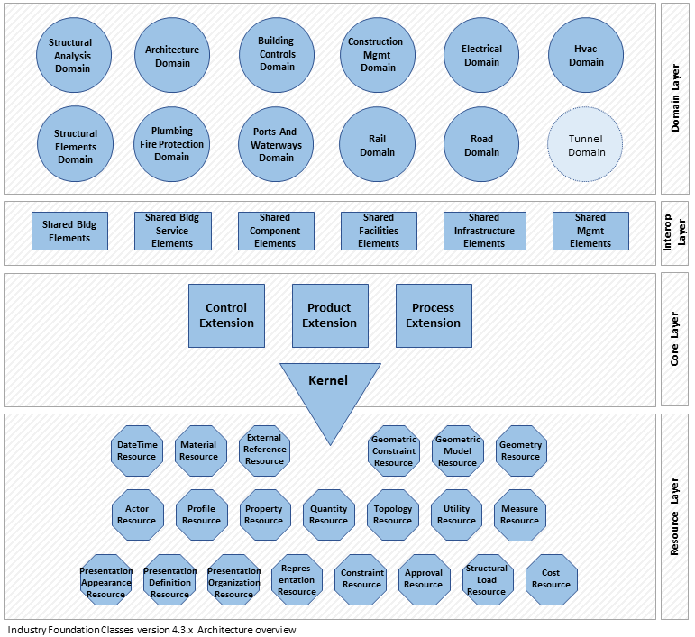

BEO stands for [Built Element Ontology](https://cramonell.github.io/beo/actual/index-en.html). It is an ontology inspired by  the entities of the [Industry Foundation Classes](https://ifc43-docs.standards.buildingsmart.org/) schema(IFC) that represent built elements and spatial configurations in the built environment. In this repository you will find two converters: a schema converter from IFC (express) to BEO (owl) and a IFC-to-RDF file converter . The file converter also uses ontologies for managing geometrical information: [FOG](https://mathib.github.io/fog-ontology/), [GOM](https://mathib.github.io/gom-ontology/#) and [OMG](https://w3id.org/omg#).

## How to Use
1. **Installation**:
   - Install python in your machine
   - clone this repository
   - Install requirements : [ifcopenshell](https://ifcopenshell.org/), [rdflib](https://rdflib.readthedocs.io/en/stable/index.html)

2. **Usage**:
   - For both converters jus  run the script  either from the command line or from your prefered code editor. Each converter use a config.json file (explained below).
  
3. **Configuration - IFCowl generator ([beo-gen](https://github.com/cramonell/beo/tree/main/beo-gen))**:
   - *ifc-schema*: IFC schema version from which to generate the ontology
   - *output-path*: path were the output file will be saved
   - *output-format*: file format (ttl, nt, rdf/xml ...)

4. **Configuration - IFC to RDF converter ([IFC-converter](https://github.com/cramonell/beo/tree/main/IFC-converter))**:
   - *ifc-file-path*: path of the input IFC file (IFC4X3_Add2, IFC4_Add1, IFC2X3_TC1)
   - *rdf-ouput*:
        - *output-path*: path were the output file will be saved
        - *output-name*: name that will be used for the output graph file, the output geometry file, and will be appended to the base url
        - *ouput-format*: file format (ttl, nt, rdf/xml ...)
        - *base-url*: base url for the graph instances
    - *geometry-ouput*:
        - *output-path*: path were the output file will be saved
        - *convert*: whether the geometry should be included or not (true/flase)
        - *in-graph*: if convert = "true", whether the geometry should be included in the graph (Conforming to IfcOwl Ontology)
        - *ouput-format*: if in-graph = "false", output geometry file format ( .ifc, .glb, .obj) --> NOT IMPLEMENTED, now only .ifc
        - *split*: if in-graph is "false", whether the geomtry of each is stored in a different file (true/flase)--> NOT IMPLEMENTED
   - *filters*:
        - *entities*: ifc entity  name list
        - *core*: entity groups in the ifc core layer
        - *shared*: entity groups in the ifc shared layer
        - *domain*: entity groups in the ifc domain layer
        - *resource*: entity groups in the ifc resource layer

        check the [structure folder](https://github.com/cramonell/ifcowl/tree/main/IFC-converter/schema_structure)
        
        
        

5. **License**:
   - This project is licensed under the GNU General Public License (GNU GPL). You can find the full text of the license in the LICENSE.txt file.

