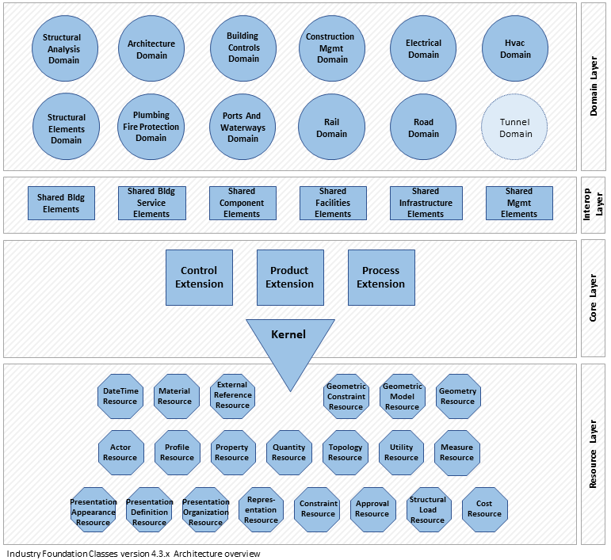

# ifcowl — IFC to OWL Conversion Tools

A pair of Python tools for working with the [IFC](https://www.buildingsmart.org/standards/bsi-standards/industry-foundation-classes/) (Industry Foundation Classes) standard in the semantic-web ecosystem, following the [ifcOWL](https://technical.buildingsmart.org/standards/ifc/ifc-formats/ifcowl/) ontology conventions.

| Tool | Folder | What it does |
|---|---|---|
| **IFCExpress2OWL** | `ifcowl-gen/` | Generates an OWL ontology from an IFC EXPRESS schema definition |
| **IFC2RDF** | `IFC-converter/` | Converts an IFC building model instance file into an RDF graph conforming to ifcOWL |

Both tools use [ifcopenshell](https://ifcopenshell.org/) to parse IFC schemas and files, and [rdflib](https://rdflib.readthedocs.io/) to build and serialise RDF graphs.

---

## Requirements

- Python ≥ 3.9
- [ifcopenshell](https://ifcopenshell.org/) ≥ 0.7
- [rdflib](https://rdflib.readthedocs.io/) == 7.0.0

```bash
pip install -r requirements.txt
```

---

## IFC2RDF — Convert an IFC file to RDF

Reads an IFC instance file and produces an RDF graph (Turtle, N-Triples, or RDF/XML) whose individuals, types, and properties follow the ifcOWL ontology.

### Usage

```bash
cd IFC-converter/
python IFC2RDF.py path/to/model.ifc [--log-level LEVEL]
```

| Argument | Description | Default |
|---|---|---|
| `input` | Path to the IFC file. Overrides `ifc-file-path` in `config.json`. | — |
| `--log-level` | Log verbosity: `DEBUG`, `INFO`, `WARNING`, `ERROR` | `INFO` |

**Example INFO output:**
```
2024-01-15 10:23:01 [INFO] File   : model.ifc  (1024000 bytes)
2024-01-15 10:23:01 [INFO] Schema : IFC4 → https://w3id.org/ifc/IFC4#
2024-01-15 10:23:01 [INFO] Output : ../tests/model.ttl
2024-01-15 10:23:01 [INFO] Load   : 0.21 s
2024-01-15 10:23:03 [INFO] Process: 2.14 s  (1840 entities, 18730 triples)
2024-01-15 10:23:03 [INFO] Serial : 0.31 s  → ../tests/model.ttl
2024-01-15 10:23:03 [INFO] Total  : 2.66 s
2024-01-15 10:23:03 [INFO] ────────────────────────────────────────────────────────────
2024-01-15 10:23:03 [INFO] File total     : 5240 entities
2024-01-15 10:23:03 [INFO] Filtered       : 3400 (excluded by config)
2024-01-15 10:23:03 [INFO] Top-level sent : 1840
2024-01-15 10:23:03 [INFO] Total created  : 1840 (incl. referenced entities)
2024-01-15 10:23:03 [INFO] Triples        : 18730
```

Use `--log-level DEBUG` to see a per-entity-type breakdown and a missing-entity audit after conversion.

### Configuration — `IFC-converter/config.json`

```jsonc
{
    "ifc-file-path": "",              // Path to IFC file. Leave empty and supply via CLI.
    "rdf-output": {
        "output-path": "../tests/",   // Directory where the .ttl output is saved
        "output-name": "",            // Output filename stem. Leave empty to auto-derive from IFC filename.
        "output-format": "ttl",       // Serialisation format: ttl | nt | rdf/xml
        "base-url": "https://example.org/assets/"  // Base URL for instance URIs in the graph
    },
    "geometry-output": {
        "convert": false,             // If true, add geometry metadata triples to the graph
        "in-graph": false,            // If true, embed geometry in the RDF graph (ifcOWL style)
        "output-format": "glb",       // Geometry file format: ifc | obj | glb | gltf | stl | ply | collada
        "split": false,               // If true, one file per element (named by GlobalId)
        "output-path": "../tests/",
        "converter": ""               // Optional: path to external CLI converter (e.g. "IfcConvert").
                                      // If empty, uses ifcopenshell.geom + trimesh (Python-native).
    },
    "filters": {
        "resource": [],   // IFC resource-layer group names to exclude (see schema_structure/)
        "shared":   [],   // IFC shared-layer group names to exclude
        "domain":   [],   // IFC domain-layer group names to exclude
        "core":     [],   // IFC core-layer group names to exclude
        "entities": []    // Specific IFC entity type names to exclude (e.g. "IfcWall")
    }
}
```

Refer to [`IFC-converter/schema_structure/`](IFC-converter/schema_structure/) for available group names.



---

## IFCExpress2OWL — Generate an OWL ontology from an IFC schema

Reads an IFC EXPRESS schema (via ifcopenshell) and produces a corresponding OWL ontology in Turtle, N-Triples, or RDF/XML.

### Usage

```bash
cd ifcowl-gen/
python IFCExpress2OWL.py
```

Schema version and output are controlled entirely by `config.json`.

### Configuration — `ifcowl-gen/config.json`

```jsonc
{
    "ifc-schema": "IFC4X3_Add2",    // ifcopenshell schema name (see Supported schemas below)
    "output-path": "./",             // Directory where the output file is saved
    "output-format": "ttl",          // Serialisation format: ttl | nt | rdf/xml
    "creators": [
        "Your Name (your@email.com)" // Appears in dce:creator of the generated ontology
    ],
    "contributors": []               // Appears in dce:contributor
}
```

---

## Supported IFC schemas

Both tools detect the IFC schema version automatically and resolve the corresponding w3id.org namespace URI. An unrecognised schema name produces a warning and falls back to `https://w3id.org/ifc/<SCHEMA_NAME>#`.

| IFC schema variant(s) | w3id.org namespace |
|---|---|
| `IFC4X3`, `IFC4X3_ADD2`, `IFC4X3_RC3` | `https://w3id.org/ifc/IFC4X3_ADD2#` |
| `IFC4` | `https://w3id.org/ifc/IFC4#` |
| `IFC4_ADD1` | `https://w3id.org/ifc/IFC4_ADD1#` |
| `IFC2X3`, `IFC2X3_TC1` | `https://w3id.org/ifc/IFC2X3_TC1#` |
| `IFC2X3_FINAL` | `https://w3id.org/ifc/IFC2X3_Final#` |

---

---

## License

This project is licensed under the GNU General Public License (GNU GPL).  
See [`LICENSE.txt`](LICENSE.txt) for the full text.
